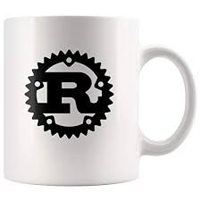

# **Rust play**

### **Description**

Collection of **rust** programs from the official book [The Rust Programming Language](https://doc.rust-lang.org/book/index.html).

### **Playground**

+ [hello_cargo](hello_cargo)

_Hack without fear!_

### **Resources**

+ [into_rust()](http://intorust.com/)

### **Doc**

+ [Rust Documentation](https://doc.rust-lang.org/)

### **License**

This work is unlicensed under the terms of [Unlicense](http://unlicense.org/).
